基于 Spring Boot 的博客系统


# 第1章 Spring Boot 简介

## 1.1、项目导学/教程导学

### 1.1.1、项目概述

> 名称：基于 Spring Boot 的博客系统
> 功能：注册博主、发博客、评论、点赞、全文检索、文件上传...
> 技术：前端、后端、数据库、NoSQL...
> 目的：掌握企业级应用开发的流程，提升核心竞争力

### 1.1.2、核心功能

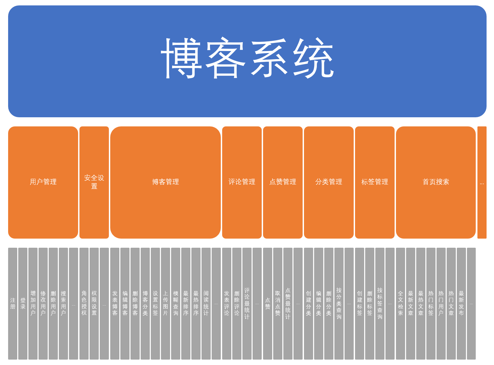

#### 博客系统：

#####  用户管理：

> 注册
> 登录
> 增加用户
> 修改用户
> 删除用户
> 搜索用户
> ...

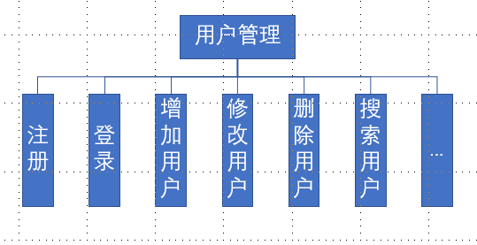

##### 安全设置：

> 角色授权 博客的用户分为管理员和普通用户，可以根据角色来设置
> 权限设置
> ...

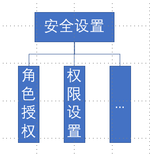

##### 博客管理：

> 发表博客
> 编辑博客
> 删除博客
> 博客分类
> 设置标签
> 上传图片
> 模糊查询
> 最新排序
> 最热排序
> 阅读统计
> ···

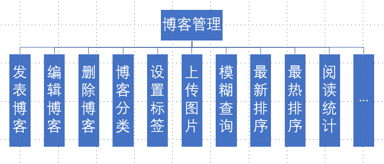

##### 评论管理：

> 发表评论
> 删除评论
> 评论量统计
> ···

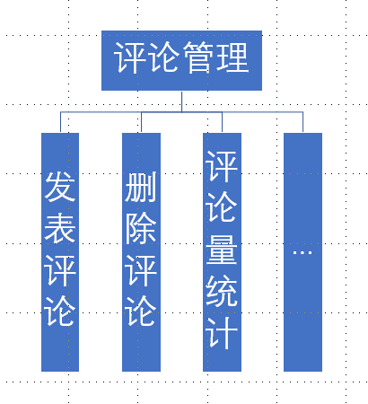

##### 点赞管理：

> 点赞
> 取消点赞
> 点赞量统计
> ···

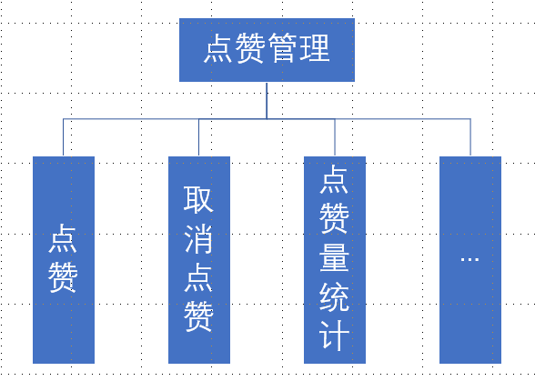

##### 分类管理：

> 创建分类
> 编辑分类
> 删除分类
> 按分类查询
> ···

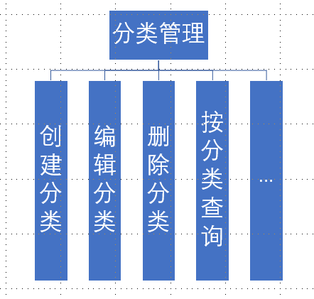

##### 标签管理：

> 创建标签
> 删除标签
> 按标签查询
> ···

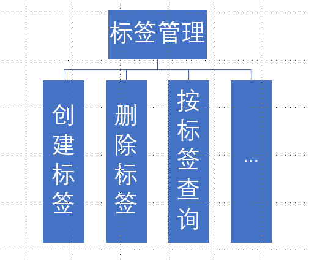

##### 首页搜索：

> 全文检索
> 最新文章
> 最热文章
> 热门标签
> 热门用户
> 热门文章
> 最新发布
> ···

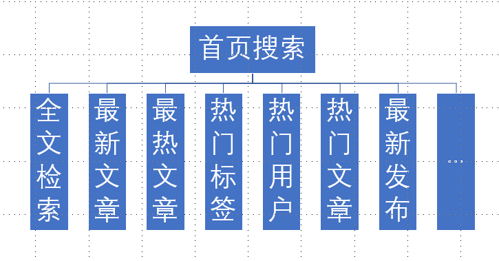

##### ...

### 1.1.3、核心技术

#### 前端：

> Bootstrap
> Thymeleaf
> jQuery
> H5
> JS
> CSS

#### 后端：

> Spring
> Spring Boot
> Spring MVC
> Spring Data
> Spring Security
> Hibernate/Mybatis/Mybatis-Plus

#### 数据存储：

> MySQL
> H2 开发测试中使用
> MongoDB：存储非结构化数据，比如文件、图片之类

#### 其他：

> ElasticSearch 全文检索
> Maven 项目管理

### 1.1.4、讲解方式/教程方式

> 精讲技术：各个攻破
> 功能累加：步步为营

### 1.1.5、系统展示

`未完待续...`

### 1.1.6、项目安排/教程安排

#### 前面部分：实战入门阶段

> Maven
> 开发环境搭建及项目运行
> Thymeleaf知识讲解
> 数据持久化讲解及实战
> 全文搜索讲解及实战
> Bootstrap讲解及实战

#### 中间部分：实战进阶阶段

> 架构设计与分层
> 需求分析与设计
> 权限管理
> 整体框架搭建
> API设计

#### 后边部分：实战高级阶段

> 用户管理实现
> 角色管理实现
> 权限管理实现
> 博客管理实现
> 评论管理实现
> 点赞管理实现
> 标签管理实现
> 首页搜索实现

### 1.1.7、学习收获

> 学会了 Spring Boot 及周边技术栈
> 掌握如何运用上述技术进行整合，搭建框架的能力
> 熟悉完整企业级应用来发的流程
> 掌握如何打造一款企业级应用的产品

### 1.1.8、教程特色

> 技术涉及广
> 技术点符合主流
> 知识点梳理+实战案例
> 真实可用的企业级应用——博客系统

### 1.1.9、适合人群

> Java开发者
> 对Spring Boot及企业级应用开发感兴趣的朋友
> 对从零到一架构感兴趣的朋友

### 1.1.10、注意事项

> 有一定的Spring开发经验
> 环境配置，尽量保持一致
> 环境配置

## 1.2、Spring Boot 是什么？

### 1.2.1、是什么？

> 为所有 Spring 开发提供一个更快更广泛的入门体验
> 开箱即用，不合适也可以快去抛弃
> 提供一系列大型项目常用的非功能特性
> 零配置（不需要 xml 配置，遵循“约定大于配置”）

### 1.2.2、Spring Boot 简化开发
> 简而言之，Spring Boot 为简化开发而生，抛弃了传统 JavaEE 项目繁琐的配置、学习过程，让企业级应用开发过程变得 so easy！

### 1.2.3、Spring Boot 与其他框架的关系
> Spring 
> → Spring MVC：Web解决方案
> → Spring Boot：快速开发的集成框架，快速开发的一个基础
> → Spring Cloud：一整套微服务解决方案

# 第2章 开启 Spring Boot 的第一个 Web 项目

## 2.1、初始化第一个Web项目

### 2.1.1、学习目标

- 快速创建一个 Spring Boot 的 Web 项目
- 学会使用 Maven 构建应用
- 理解 Spring Boot 项目的结构、原理

### 2.1.2、环境配置

JDK8+
Maven 3.6.0

### 2.1.3、通过 Spring Initializr 初始化一个 Web 项目

在浏览器输入 https://start.spring.io/ ，可以看到可以看到如下图所示的网页，我们可以在线初始化一个 Spring Boot 的 Web项目：

我们选择使用 `Maven` 来管理项目，依次选择 Spring Boot 版本，填写 `groupId` 和 `artifactId`，添加 `Web` 和 `Lombok` 依赖,

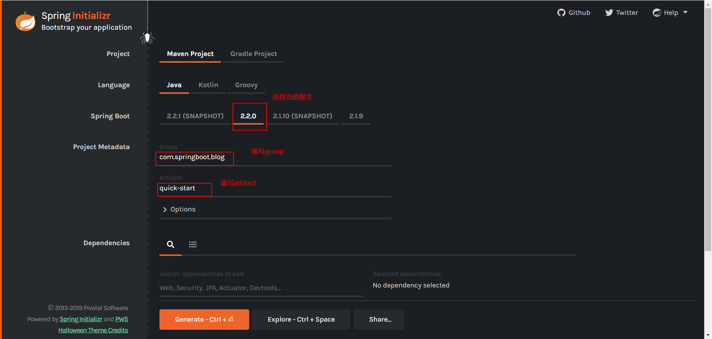

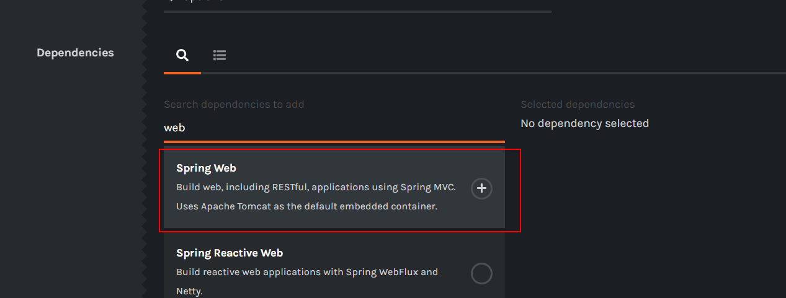

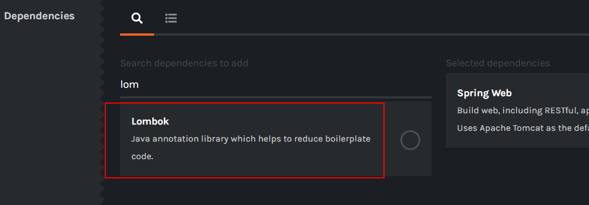

最后点击 `Generate ..`按钮生成项目，可以看到会自动生成一个maven项目下载到本地

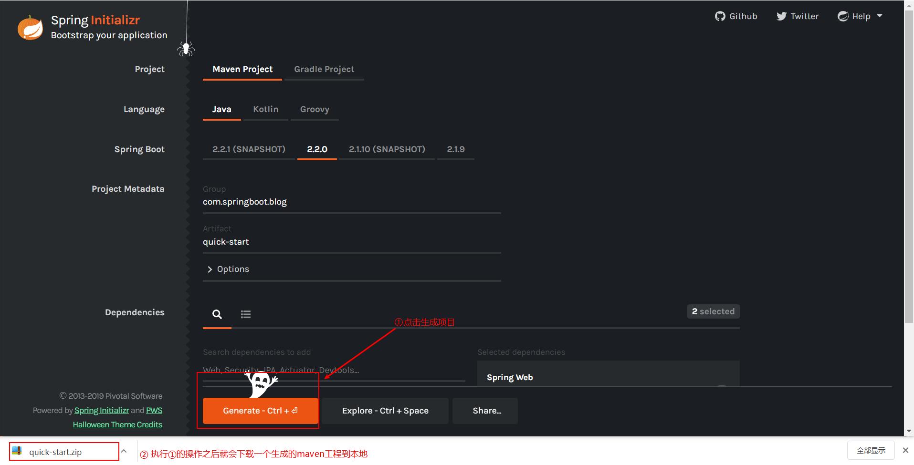

找一个合适的目录解压上面的文件，可以得到如下目录结构，至此我们的 Web 项目就初始化完了

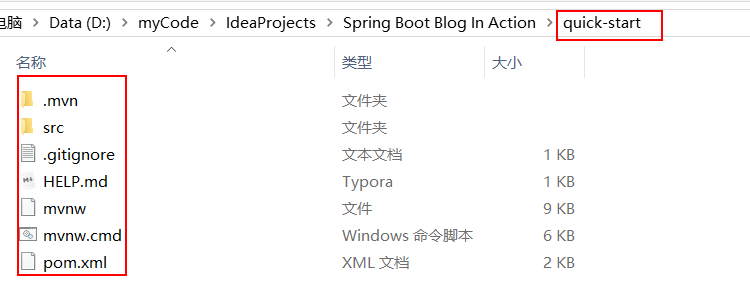

### 2.1.4、用 Maven 编译项目

上一步我们初始化了一个 maven 项目，现在我们来编译这个项目。

如下图所示，在 idea 中打开我们的项目：

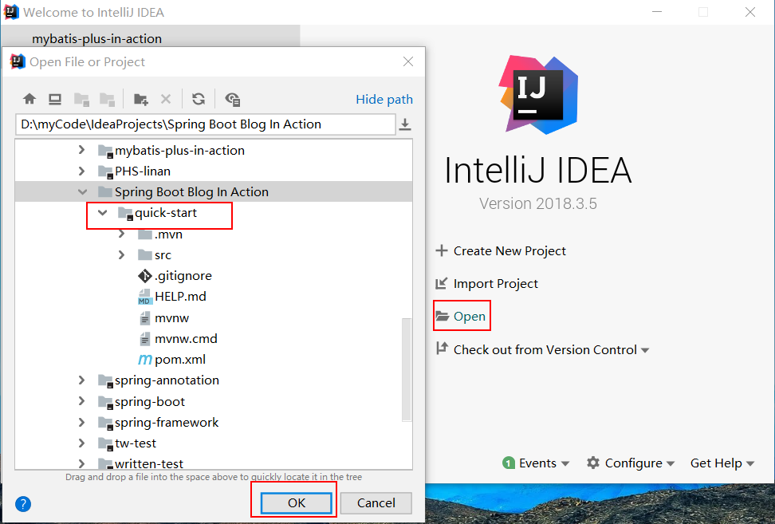

然后执行 `mvn compile`编译项目：

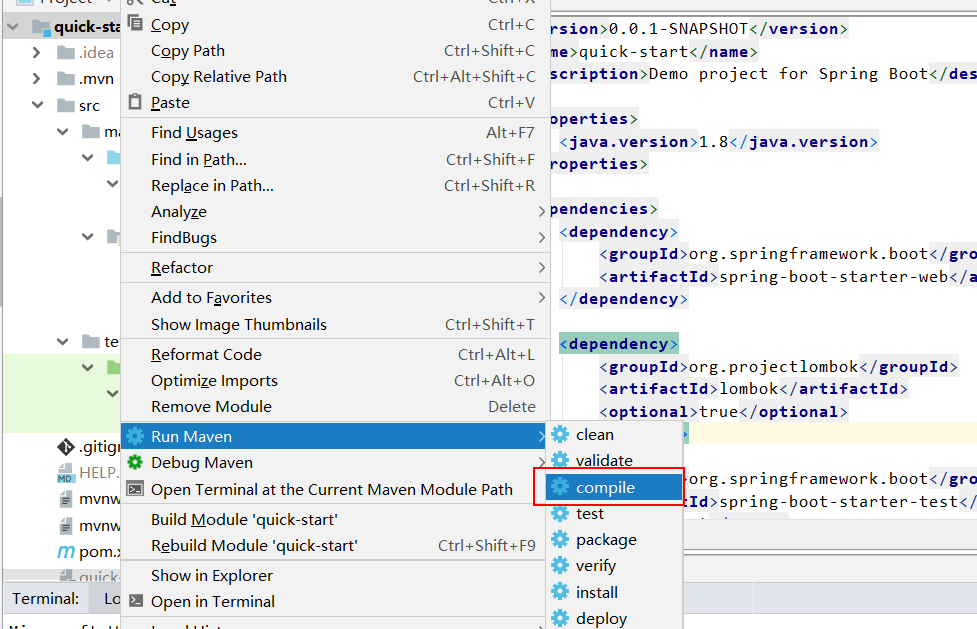

然后再执行`mvn package`得到一个 `jar` 包：

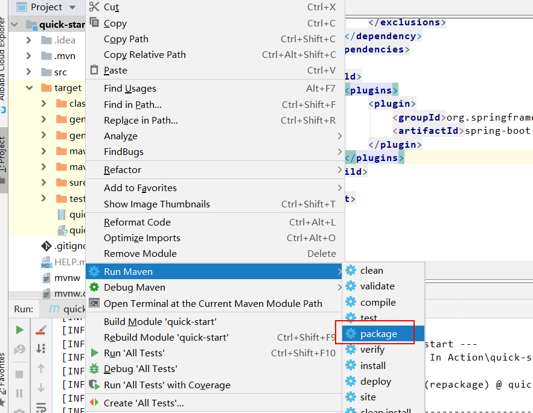

在 jar 包所在目录执行 `java -jar quick-start-0.0.1-SNAPSHOT.jar` 命令，可以看到，我们的项目在 Tomcat 的 8080 端口被启动：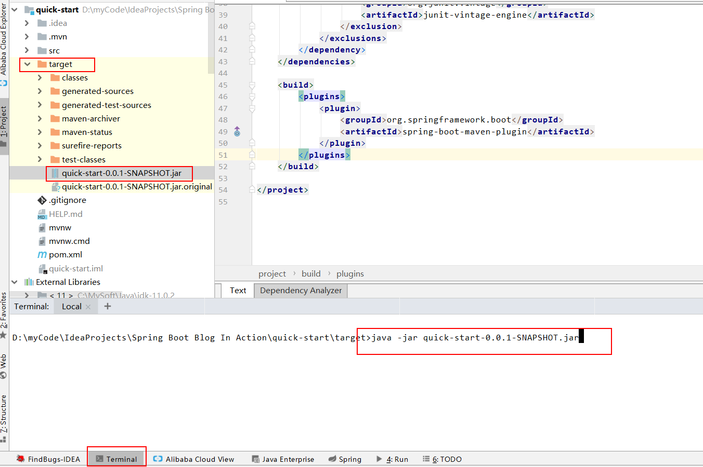

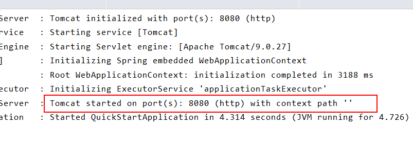

至此，我们的项目编译，启动遍完成了。如要结束当前项目的运行，在命令行按下`Ctrl+C`即可终止当前程序。

我们在 idea 中启动我们的项目，然后再浏览器地址栏访问 `http://localhost:8080/` ,可以看到我们返回了一个错误页面

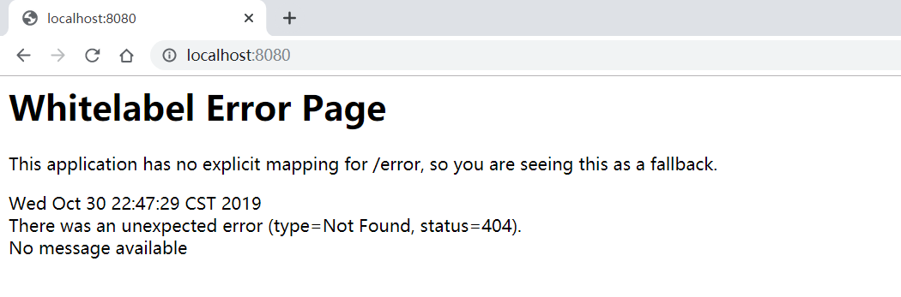

上图的错误页面，是因为我们当前的项目中还没有加入页面控制器，现阶段可以忽略不计。能看到上图所示页面就说明我们的项目是正常的，可以启动的。

### 源代码

[quick-start](https://github.com/Runewbie/Spring-Boot-Blog-In-Action/tree/master/quick-start)

# 第3章 一个Hello World项目

这一章我们使用 idea 来新建一个 Spring Boot 的  Web 项目 Hello World

首先我们在 idea 中，选择 `File` → `New` → `Project` 新建一个项目，我们选择使用 `Speing Initialzr` 新建一个项目：

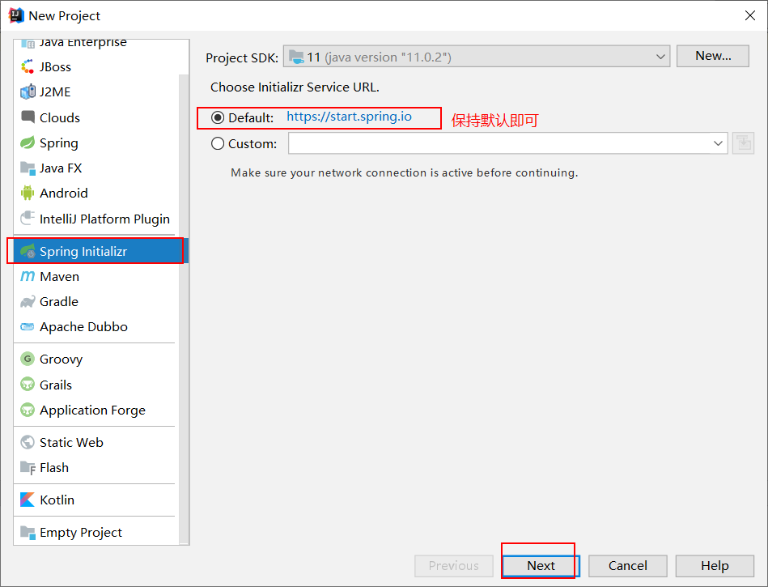

输入我们的 groupId ：`com.springboot.blog ` 和 artifactId ： `hello-world` ,然后next

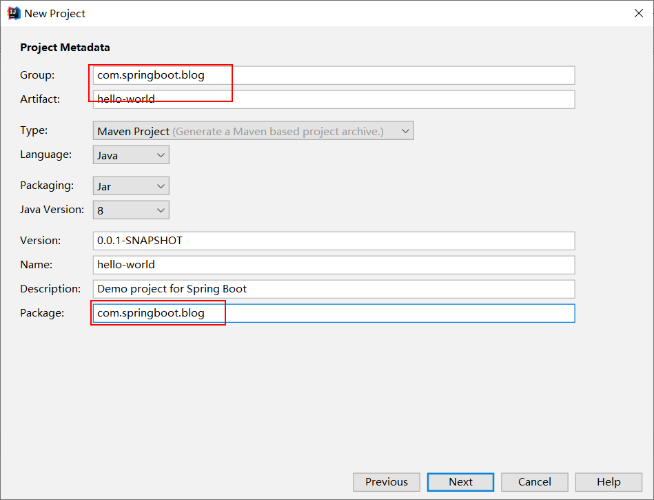

添加 `Lombok` 和 `Spring Web` 依赖：

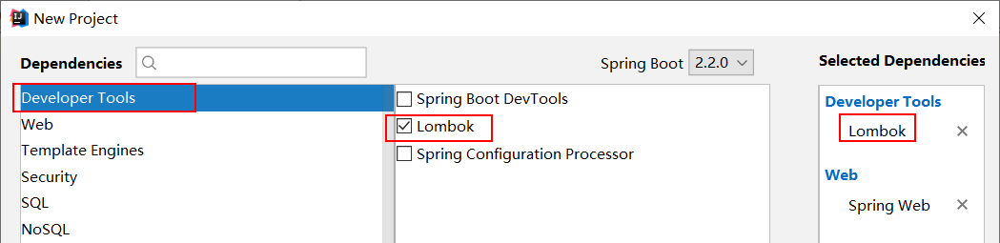

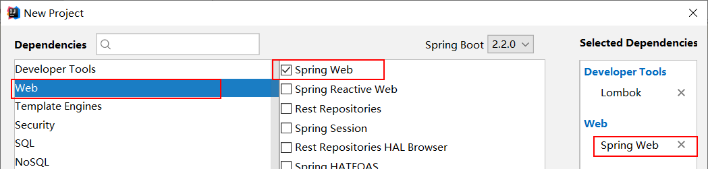

然后点击 `Next` ，确认好项目名之后点击 `Finish`

创建之后的项目结构如下图所示：

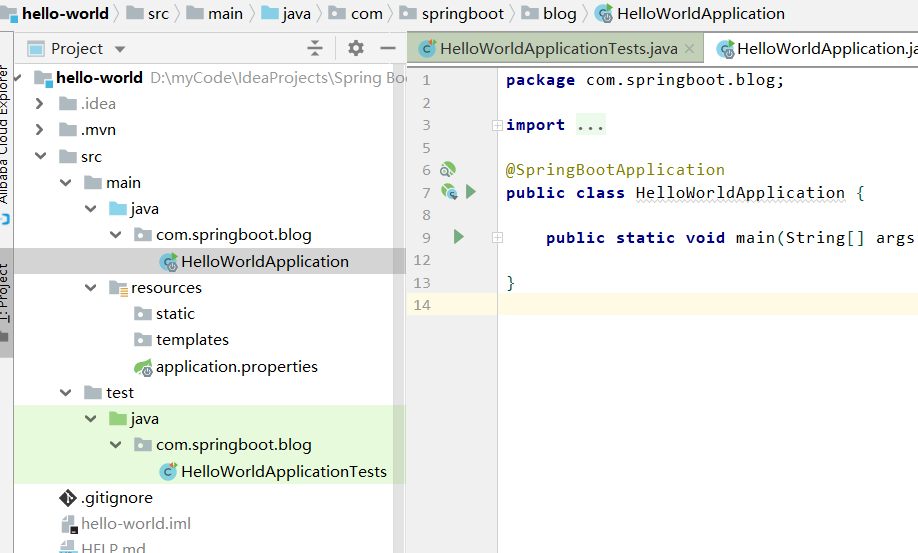

我们先来观察一下我们的代码，将鼠标放在 `@SpringBootApplication` 注解上，可以看到它其实包含了很多注解：

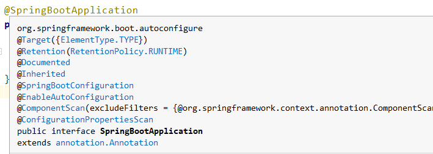

`@EnableAutoConfiguration` ：根据类路径，开启 Spring 上下文的自动配置

`@ComponentScan`：自动扫描包下的带有 `@Component` 注解的bean，可以使用 `@Autowired` 实现自动注入功能

我们在 `com.springboot.blog.controller` 包下新建一个 `Controller` 类—— `HelloController`：

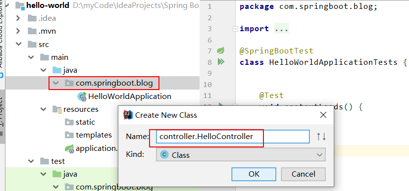

HelloController 类代码如下：

```java
@RestController // @RestController = @Controller + @ResponseBody，返回一个符合restful风格的 json串
public class HelloController {

    @RequestMapping("/hello")
    public String Hello() {
        return "Hello World！";
    }
}
```

接着我们在 test 的 `com.springboot.blog.controller` 包下新建一个 `HelloControllerTest` 测试类，使用测试用例来测试我们 `HelloController`的中 `hello` 方法,HelloControllerTest 代码如下：

```java
@SpringBootTest
public class HelloControllerTest {

    @Autowired
    private MockMvc mockMvc;

    @Test
    void contextLoads() throws Exception {
        mockMvc.perform(MockMvcRequestBuilders.get("/hello").accept(MediaType.APPLICATION_JSON))
                .andExpect(MockMvcResultMatchers.status().isOk())
                .andExpect(MockMvcResultMatchers.content().string(Matchers.equalTo("Hello World!")));
    }
}
```

运行上面的测试用例，会提示我们测试失败，失败信息如下：

``` properties
Caused by: org.springframework.beans.factory.NoSuchBeanDefinitionException: No qualifying bean of type 'org.springframework.test.web.servlet.MockMvc' available: expected at least 1 bean which qualifies as autowire candidate. Dependency annotations: {@org.springframework.beans.factory.annotation.Autowired(required=true)}
```

这是因为我们测试用例运行的时候找不到 `MockMvc`,导致的，在idea中我们也可以看到即使我们使用了 `@Autowired` 注解 来自动注入了 `MockMvc` , 还是会提示无法自动注入

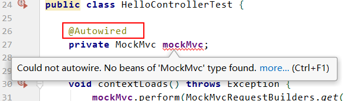

这个时候我们需要在测试类上添加  `@AutoConfigureMockMvc`  注解来解决这个错误，完整测试用例代码如下：

```java
@SpringBootTest
@AutoConfigureMockMvc // 在使用 MockMvc 进行测试时，一定不要忘了加上该注解
public class HelloControllerTest {

    @Autowired
    private MockMvc mockMvc;

    @Test
    void contextLoads() throws Exception {
        mockMvc.perform(MockMvcRequestBuilders.get("/hello").accept(MediaType.APPLICATION_JSON))
                .andExpect(MockMvcResultMatchers.status().isOk())
                .andExpect(MockMvcResultMatchers.content().string(Matchers.equalTo("Hello World!")));
    }
}
```

处理完前边的自动注入错误，我们再来运行我们的测试用例，可以看到测试用例运行成功：

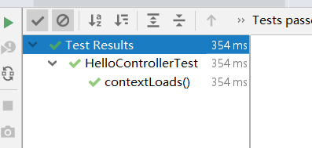

这时运行 `HelloWorldApplication` 启动我们的项目，在浏览器访问 `http://localhost:8080/hello` 可以看到下面的结果：

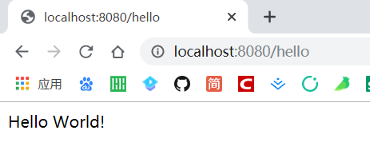

以上，就是我们在idea中新建 Spring Boot 项目的一个过程，更过内容可以查看源代码了解。

### 源代码

[hello-world](https://github.com/Runewbie/Spring-Boot-Blog-In-Action/tree/master/hello-world)

# 第4章 开发环境的搭建

## 4.1、本节目标

- 安装、配置IDE
- 常用插件、配置

## 4.2、环境配置

- JDK 8 +

  请读者自行在 [Oracle](https://www.oracle.com/technetwork/java/javase/downloads/jdk8-downloads-2133151.html) 官网下载 JDK8+ 版本，并安装配置好

- Maven 3.6 +

  1、安装Maven：请读者自行在 [Maven](https://maven.apache.org/download.cgi) 官网下载，解压并配置环境变量

  2、idea配置Maven：

  修改 `<mirrors>` 标签配置，使用阿里云镜像仓库加速依赖文件下载：

  ```xml
  <mirror>
      <id>alimaven</id>
      <mirrorOf>central</mirrorOf>
      <name>aliyun maven</name>
      <url>http://maven.aliyun.com/nexus/content/groups/public/</url>
  </mirror>
  ```

  修改 `<profiles>` 标签配置，使用JDK8为项目默认编译版本：

  ```xml
  <profile> 
      <id>JDK-1.8</id>  
      <activation> 
          <activeByDefault>true</activeByDefault>  
          <jdk>1.8</jdk> 
      </activation>  
      <properties> 
          <maven.compiler.source>1.8</maven.compiler.source>  
          <maven.compiler.target>1.8</maven.compiler.target>  
          <maven.compiler.compilerVersion>1.8</maven.compiler.compilerVersion> 
      </properties> 
  </profile>
  ```

  修改 `<localRepository>` 标签，设置本地依赖存储仓库位置：

  ```xml
  <localRepository>D:\myCode\maven_repository</localRepository>
  ```

  

  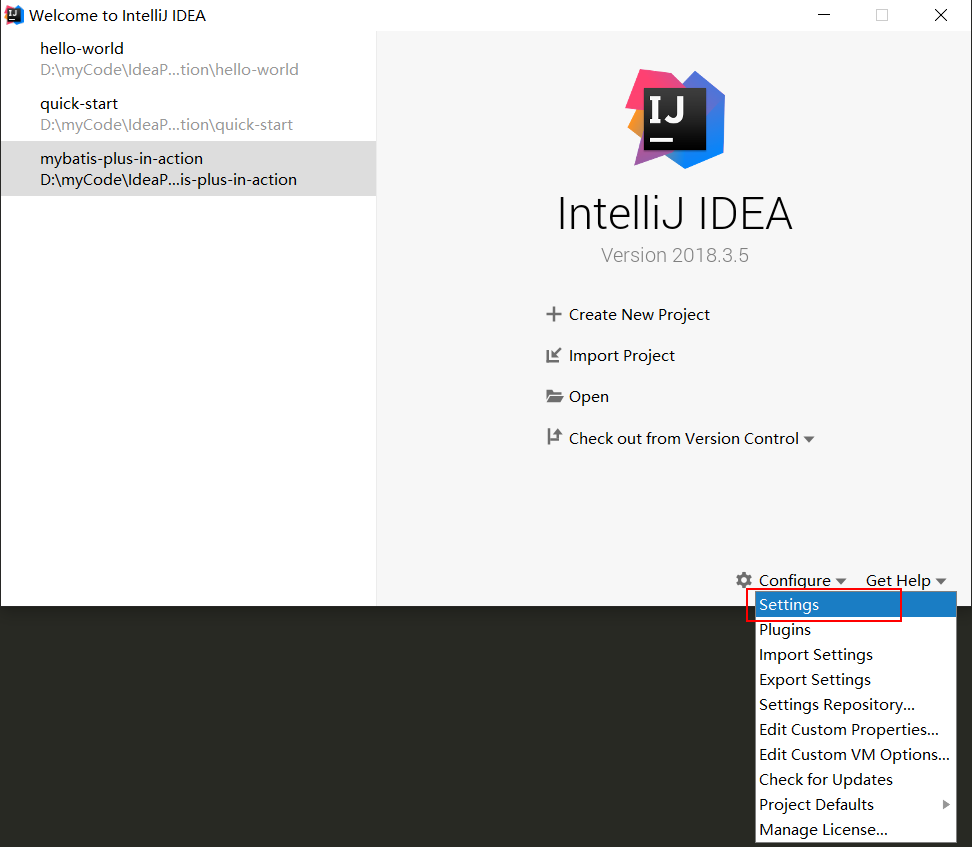

  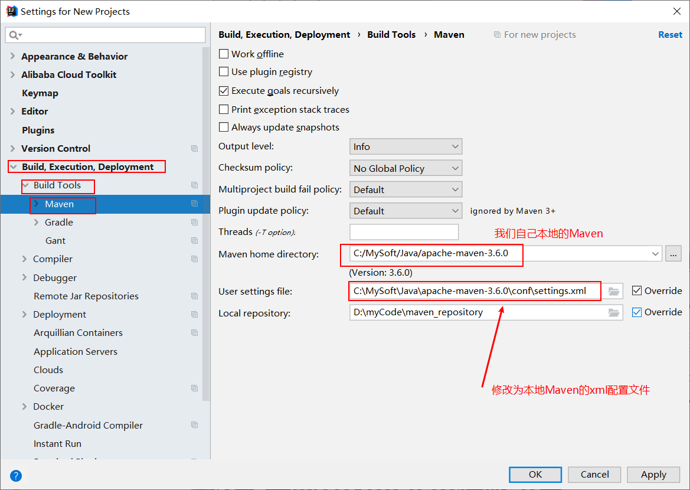

- Idea

  请读者自行在 [IDEA](http://www.jetbrains.com/) 官网下载安装配置好

  [IntelliJ IDEA 常用插件](https://mp.weixin.qq.com/s/zyIKY0Bc7DXic7kQN-zuRA)

# 第5章 集成Thymeleaf模版引擎

## 5.1、Thymeleaf 

### 5.1.1、Thymeleaf 简介

- 模板引擎：Thymeleaf 是一种用于Web和独立环境的现代服务器端的 Java 模板引擎。能够处理 HTML，XML，JavaScript，CSS 甚至纯文本。类似于 JSP、Freemarker。

- 自然模板，原型即界面：Thymeleaf建立在自然模板的概念之上，以不影响模板作为设计原型的方式将其逻辑注入到模板文件中。 这改善了设计沟通，弥合了前端设计和开发人员之间的理解偏差。
- 语法优雅易懂：支持 `OGNL` 和 `SpringEL` 表达式
- 遵循 Web 标准：支持 `HTML5`

### 5.1.2、Thymeleaf 标准方言

1、什么是标准方言？

定义了一组功能的 Thymeleaf 语法。

例如：包含以`th`前缀开头的属性，如`<span th:text="...">` 或 `<span data-th-text="...">`

Thymeleaf 模板：

```xml
<!DOCTYPE html>
<html xmlns:th="http://www.thymeleaf.org">
  <head>
    <title>Good Thymes Virtual Grocery</title>
    <meta http-equiv="Content-Type" content="text/html; charset=UTF-8" />
    <link rel="stylesheet" type="text/css" media="all" 
          href="../../css/gtvg.css" th:href="@{/css/gtvg.css}" />
  </head>
  <body>
    <p th:text="#{home.welcome}">Welcome to our grocery store!</p>
  </body>
</html>
```

在接下来的内容中，我们会学到关于 Thymeleaf  的一下内容：

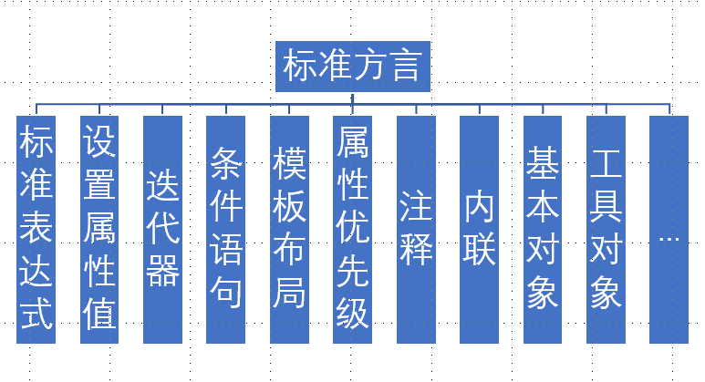

2、标准表达式语法

Thymeleaf属性允许将它们的值设置为或包含表达式，由于它们使用的方言，我们将其称为标准表达式。这些表达式可以有五种类型:

- `${...}` : 变量表达式。
- `*{...}` : 选择表达式。
- `#{...}` : 消息 (i18n) 表达式。
- `@{...}` : 链接 (URL) 表达式。
- `~{...}` : 片段表达式。

2.1、变量表达式

变量表达式是OGNL表达式 - 如果将*Thymeleaf* 与*Spring* - 集成在上下文变量上(也称为Spring术语中的模型属性)，则为*Spring EL*。 它们看起来像这样:

```jsp
${session.user.name}
```

它们作为属性值或作为它们的一部分，取决于属性:

```jsp
<span th:text="${book.author.name}">
```

2.2、选择表达式

选择表达式就像变量表达式一样，它们不是整个上下文变量映射上执行，而是在`先前选择的对象`。 它们看起来像这样:

```jsp
*{customer.name}
```

它们所作用的对象由`th:object`属性指定:

```jsp
<div th:object="${book}">
  ...
  <span th:text="*{title}">...</span>
  ...
</div>
```

2.3、消息(i18n)表达式

消息表达式(通常称为文本外部化，国际化或i18n)允许从外部源(如:`.properties`)文件中检索特定于语言环境的消息，通过键来引用这引用消息。

在Spring应用程序中，它将自动与Spring的MessageSource机制集成。如下：

```xml
#{main.title}
#{message.entrycreated(${entryId})}
```

以下是在模板中使用它们的方式:

```xml
<table>
  ...
  <th th:text="#{header.address.city}">...</th>
  <th th:text="#{header.address.country}">...</th>
  ...
</table>
```

2.4、链接(URL)表达式

链接表达式在构建URL并向其添加有用的`上下文`和`会话信息(通常称为URL重写的过程)`。
因此，对于部署在Web服务器的`/myapp`上下文中的Web应用程序，可以使用以下表达式:

```jsp
<a th:href="@{/order/list}">...</a>
```

可以转换成如下的东西:

```jsp
<a href="/myapp/order/list">...</a>
```

甚至，如果需要保持会话，并且cookie未启用(或者服务器还不知道)，那么生成的格式为:

```xml
<a href="/myapp/order/list;jsessionid=s2ds3fa31abd241e2a01932">...</a>
```

网址也可以带参数，如下所示:

```jsp
<a th:href="@{/order/details(id=${orderId},type=${orderType})}">...</a>
```

这将产生类似以下的结果 - 

```xml
<!-- 注意＆符号会在标签属性中进行HTML转义... -->
<a href="/myapp/order/details?id=23&type=online">...</a>
```

链接表达式可以是相对的，在这种情况下，应用程序上下文将不会被加到URL的前面:

```jsp
<a th:href="@{../documents/report}">...</a>
```

也是服务器相对的(同样，没有应用程序上下文的前缀):

```xml
<a th:href="@{~/contents/main}">...</a>
```

和协议相关(就像绝对URL一样，但浏览器将使用与正在显示的页面相同的HTTP或HTTPS协议):

```xml
<a th:href="@{//static.mycompany.com/res/initial}">...</a>
```

当然，链接表达式也可以是绝对的:

```xml
<a th:href="@{http://www.mycompany.com/main}">...</a>
```

但是绝对(或协议相对)URL ，在 Thymeleaf 链接表达式中应该添加什么值？ 很简单:由响应过滤器定义URL重写:在基于Servlet的Web应用程序中，对于每个输出的URL(上下文相对，相对，绝对…)，在显示URL之前，Thymeleaf总是调用`HttpServletResponse.encodeUrl(...)`机制。 这意味着一个过滤器可以通过包装HttpServletResponse对象来为应用程序执行自定义的URL重写。

2.6、片段表达式

片段表达式是一种简单的方法用来表示标记的片段并将其移动到模板中。 由于这些表达式，片段可以被复制，传递给其他模板的参数等等。

最常见的是使用`th:insert`或`th:replace`来插入片段:

```xml
<div th:insert="~{commons :: main}">...</div>
```

但是它们可以在任何地方使用，就像任何其他变量一样:

```jsp
<div th:with="frag=~{footer :: #main/text()}">
  <p th:insert="${frag}">
</div>
```

2.5、 文字和操作

有很多类型的文字和操作可用，它们分别如下:

- 文字
  - 文本文字，例如:`'one text'`, `'Another one!'`,`…`
  - 数字文字，例如:`0`,`10`, `314`, `31.01`, `112.83`,`…`
  - 布尔文字，例如:`true`,`false`
  - Null文字，例如:`Null`
  - 文字标记，例如:`one`, `sometext`, `main`,`…`
- 文本操作:
  - 字符串连接:`+`
  - 文字替换:`|The name is ${name}|`
- 算术运算:
  - 二进制操作:`+`, `-`, `*`, `/`, `%`
  - 减号(一元运算符):`-`
- 布尔运算:
  - 二进制运算符，`and`,`or`
  - 布尔否定(一元运算符):`!`,`not`
- 比较和相等:
  - 比较运算符:`>`,`<`,`>=`,`<=`(`gt`,`lt`,`ge`,`le`)
  - 相等运算符:`==`, `!=` (`eq`, `ne`)
- 条件操作符:
  - If-then:`(if) ? (then)`
  - If-then-else:`(if) ? (then) : (else)`
  - Default: `(value) ?: (defaultvalue)`

### 5.1.3、设置属性值

1、设置任意属性值：`th:att`

假设我们的网站发布了一个时事通讯，我们希望我们的用户能够订阅它，所以我们创建一个带有表单的`/WEB-INF/templates/subscribe.html`模板：

```xml
<form action="subscribe.html">
  <fieldset>
    <input type="text" name="email" />
    <input type="submit" value="Subscribe!" />
  </fieldset>
</form>
```

与 Thymeleaf 一样，此模板更像是静态原型，而不是 web application 的模板。首先，我们表单中的`action`属性静态链接到模板文件本身，因此没有地方可以进行有用的 URL 重写。其次，提交按钮中的`value`属性使其显示英文文本，但我们希望它能够国际化。

使用`th:attr`属性，以及更改其设置的标记属性的 value 的能力：

```xml
<form action="subscribe.html" th:attr="action=@{/subscribe}">
  <fieldset>
    <input type="text" name="email" />
    <input type="submit" value="Subscribe!" th:attr="value=#{subscribe.submit}"/>
  </fieldset>
</form>
```

这个概念非常简单：`th:attr`只需要一个为属性赋予 value 的表达式。创建了相应的控制器和消息 files 后，处理该文件的结果将是：

```xml
<form action="/gtvg/subscribe">
  <fieldset>
    <input type="text" name="email" />
    <input type="submit" value="¡Suscríbe!"/>
  </fieldset>
</form>
```

除了新的属性值之外，您还可以看到 applicacion context name 已自动添加到`/gtvg/subscribe`中的 URL 基础作为前缀。

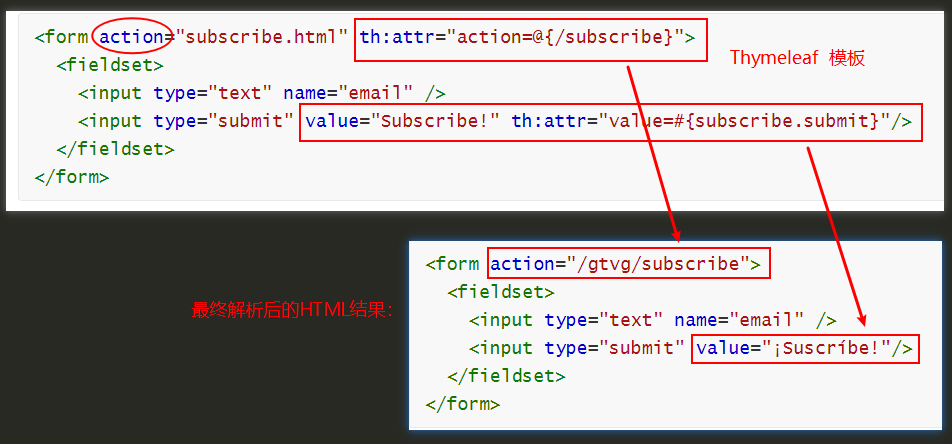

2、将 value 设置为特定属性

到现在为止，你可能会想到以下内容：

```xml
<input type="submit" value="Subscribe!" th:attr="value=#{subscribe .submit}"/>
```

这是一个非常丑陋的标记。在属性的 value 中指定赋值可能非常实用，但如果你必须在 time 中完成，那么它不是创建模板的最优雅方式。

Thymeleaf 同意你的意见，这就是为什么在模板中几乎不使用`th:attr`的原因。通常，您将使用其任务设置特定标记属性的其他`th:*`属性(而不仅仅是`th:attr`之类的任何属性)。

对于 example，要设置`value`属性，请使用`th:value`：

```xml
<input type="submit" value="Subscribe!" th:value="#{subscribe.submit}"/>
```

这看起来好多了！让我们尝试对`form`标签中的`action`属性执行相同的操作：

```xml
<form action="subscribe.html" th:action="@{/subscribe}">
```

简化如下图所示：

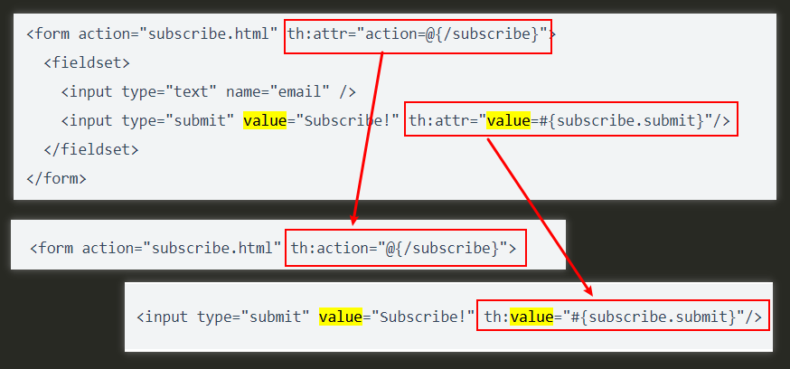

有很多这样的属性，每个属性都针对特定的 HTML5 属性，更多特定属性可以参考官方文档：

|                   |              |                     |
| ----------------- | ------------ | ------------------- |
| `th:abbr`         | `th:accept`  | `th:accept-charset` |
| `th:accesskey`    | `th:action`  | `th:align`          |
| `th:alt`          | `th:archive` | `th:audio`          |
| `th:autocomplete` | `th:axis`    | `th:background`     |
| `...`             | `...`        | `...`               |

3、固定值布尔属性Fixed-value boolean 属性

HTML 具有 boolean 属性的概念，没有 value 的属性和 1 的 precence 意味着 value 是“true”。在 XHTML 中，这些属性只占用 1 value，这本身也是如此。

对于 example，`checked`：

```xml
<input type="checkbox" name="option2" checked /> <!-- HTML -->
<input type="checkbox" name="option1" checked="checked" /> <!-- XHTML -->
```

标准方言包含允许您通过评估条件来设置这些属性的属性，因此如果计算为 true，则属性将设置为其固定 value，如果计算为 false，则不会设置该属性：

```xml
<input type="checkbox" name="active" th:checked="${user.active}" />
```

标准方言中存在以下 fixed-value boolean 属性，更多属性可以参考官方文档：

|                     |                |                 |
| ------------------- | -------------- | --------------- |
| `th:async`          | `th:autofocus` | `th:autoplay`   |
| `th:checked`        | `th:controls`  | `th:declare`    |
| `th:default`        | `th:defer`     | `th:disabled`   |
| `th:formnovalidate` | `th:hidden`    | `th:ismap`      |
| `th:loop`           | `th:multiple`  | `th:novalidate` |
| `th:nowrap`         | `th:open`      | `th:pubdate`    |
| `th:readonly`       | `th:required`  | `th:reversed`   |
| `th:scoped`         | `th:seamless`  | `th:selected`   |

### 5.1.4、迭代器

1、标准方言为我们提供了一个属性：`th:each` 来遍历属性值

```xml
<tr th:each="prod : ${prods}">
    <td th:text="${prod.name}">Onions</td>
    <td th:text="${prod.price}">2.41</td>
    <td th:text="${prod.inStock}? #{true} : #{false}">yes</td>
</tr>
```

在上面看到的`prod : ${prods}`属性 value 意味着“对于评估`${prods}`的结果中的每个元素，使用名为 prod 的变量中的当前元素重复此模板片段。

- 我们将`${prods}`称为迭代表达式或迭代变量。
- 我们将`prod`称为迭代变量或简称为变量。

2、当使用`th:each`时，Thymeleaf 提供了一种用于跟踪迭代状态的机制：状态变量。

状态变量在`th:each`属性中定义，并包含以下数据：

- 当前迭代索引，从 0 开始。这是`index` property。
- 当前迭代索引，从 1 开始。这是`count` property。
- 迭代变量中元素的总量。这是`size` property。
- 每次迭代的 iter 变量。这是`current` property。
- 当前迭代是偶数还是奇数。这些是`even/odd` boolean properties。
- 当前迭代是否是第一个。这是`first` boolean property。
- 当前迭代是否是最后一次。这是`last` boolean property。

具体使用如下图中的例子所示：

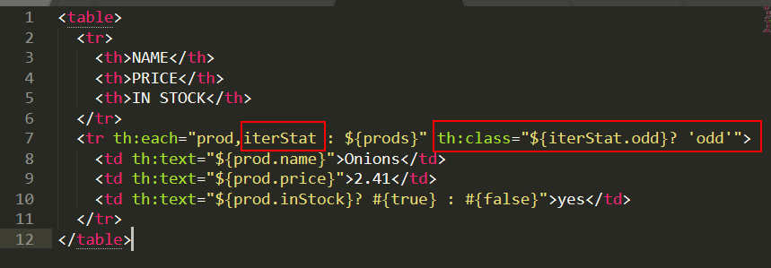

### 5.1.5、条件语句

1、简单条件：“if”和“除非”

`th:if`属性：

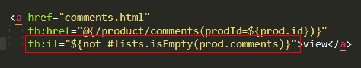

 此外，`th:if`有一个逆属性`th:unless`：

```xml
<a href="comments.html"
   th:href="@{/comments(prodId=${prod.id})}" 
   th:unless="${#lists.isEmpty(prod.comments)}">view</a>
```

2、切换语句

还有一种方法可以使用 Java 中的等效开关结构有条件地显示内容：`th:switch`/`th:case`属性集。

只要有一个`th:case`属性计算为`true`，同一个 switch context 中的其他`th:case`属性都将被计算为`false`。默认选项指定为`th:case="*"`：

```xml
<div th:switch="${user.role}">
  <p th:case="'admin'">User is an administrator</p>
  <p th:case="#{roles.manager}">User is a manager</p>
  <p th:case="*">User is some other thing</p>
</div>
```

### 5.1.6、模板布局

1、定义和引用片段

在我们的模板中，我们通常希望包含来自其他模板的部分，例如页脚，页眉，菜单......

为了做到这一点，Thymeleaf 需要我们定义这些部分，“片段”，以便包含，这可以使用`th:fragment`属性来完成。

```xml
<!DOCTYPE html>
<html xmlns:th="http://www.thymeleaf.org">
  <body>
    <div th:fragment="copy">
      &copy; 2011 The Good Thymes Virtual Grocery
    </div>
  </body>
</html>
```

上面的 code 定义了一个名为`copy`的片段，我们可以使用`th:insert`或`th:replace`属性中的一个轻松地在我们的主页中包含它(以及`th:include`，但是自 Thymeleaf 3.0 以来不再推荐使用它)：

```xml
<body>
  ...
  <div th:insert="~{footer :: copy}"></div>
</body>
```

请注意，`th:insert`需要一个片段表达式(`~{...}`)，它是一个导致片段的表达式。在上面的 example 中，这是一个 non-complex 片段表达式，(`~{`，`}`)封闭是完全可选的，所以上面的 code 等同于：

```xml
<body>
  ...
  <div th:insert="footer :: copy"></div> 
</body>
```

2、在没有 th:fragment 的情况下引用片段

由于 Markup Selector 的强大功能，我们可以包含不使用任何`th:fragment`属性的片段。它甚至可以是来自不同的 application 的标记 code，完全不了解 Thymeleaf：

```xml
...
<div id="copy-section">
  &copy; 2011 The Good Thymes Virtual Grocery
</div>
...
```

我们可以使用上面的片段简单地通过其`id`属性引用它，方式与 CSS 选择器类似：

```xml
<body>
  ...
  <div th:insert="~{footer :: #copy-section}"></div> 
</body>
```

3、th:insert 、 th:replace 和 th:include之间的区别

`th:insert`、`th:replace` 和`th:include`（自 3.0 以来不推荐)之间有什么区别：

- `th:insert`是最简单的：它只是将指定的片段作为其 host 标记的主体插入。
- `th:replace`实际上用指定的片段替换了它的 host 标记。
- `th:include`类似于`th:insert`，但它不是插入片段，而是仅插入此片段的内容。

举例：

定义一个像这样的 HTML 片段：

```xml
<footer th:fragment="copy">
  &copy; 2011 The Good Thymes Virtual Grocery
</footer>
```

使用th:insert 、 th:replace、 th:include中进行片段引用，如下所示：

```xml
<body>
  ...
  <div th:insert="footer :: copy"></div>

  <div th:replace="footer :: copy"></div>

  <div th:include="footer :: copy"></div>
  
</body>
```

最终效果：

```xml
<body>
  ...
  <div>
    <footer>
      &copy; 2011 The Good Thymes Virtual Grocery
    </footer>
  </div>

  <footer>
    &copy; 2011 The Good Thymes Virtual Grocery
  </footer>

  <div>
    &copy; 2011 The Good Thymes Virtual Grocery
  </div>
  
</body>
```

更多内容读者可以自行参考官文档，这里只做简单入门介绍。

### 5.1.7、属性优先

在同一个标签中写入多个`th:*`属性会发生什么？例如：

```xml
<ul>
  <li th:each="item : ${items}" th:text="${item.description}">Item description here...</li>
</ul>
```

我们希望在`th:text`之前执行`th:each`属性，以便我们得到我们想要的结果，但是考虑到 HTML/XML 标准没有给写入标签中的属性的 order 赋予任何意义，优先级必须在 order 中的属性本身中建立机制，以确保它将按预期工作。

因此，所有 Thymeleaf 属性都定义了一个数字优先级，它建立了在标记中执行它们的顺序。这个顺序是：

| 优先级 | 特征                | 属性                                       |
| ------ | ------------------- | ------------------------------------------ |
| 1      | 片段包含            | `th:insert` `th:replace`                   |
| 2      | 片段迭代            | `th:each`                                  |
| 3      | 有条件的 evaluation | `th:if` `th:unless` `th:switch` `th:case`  |
| 4      | 局部变量定义        | `th:object` `th:with`                      |
| 5      | 一般属性修改        | `th:attr` `th:attrprepend` `th:attrappend` |
| 6      | 具体属性修改        | `th:value` `th:href` `th:src` `...`        |
| 7      | 文字(标签正文修改)  | `th:text` `th:utext`                       |
| 8      | 片段规范            | `th:fragment`                              |
| 9      | 片段删除            | `th:remove`                                |

### 5.1.8、Comments（注释）

1、标准 HTML/XML comments

标准 HTML/XML comments `<!-- ... -->`可以在 Thymeleaf 模板中的任何位置使用。这些 comments 中的任何内容都不会由 Thymeleaf 处理，并将逐字复制到结果中：

```xml
<!-- User info follows -->
<div th:text="${...}">
  ...
</div>
```

2、Thymeleaf 解析器级注释块

Thymeleaf 将删除`<!--/*`和`*/-->`之间的所有内容，因此当模板静态打开时，这些 comment 块也可用于显示 code，知道在 Thymeleaf 处理它时它将被删除：

```xml
<!--/*--> 
  <div>
     you can see me only before Thymeleaf processes me!
  </div>
<!--*/-->
```

3、原型注释块

Thymeleaf prototype-only ：当模板静态打开(比如作为原型)时，Thymeleaf 允许定义标记为 原型注释的特殊注释块，但在执行模板时 Thymeleaf 认为是正常标记。

```xml
<span>hello!</span>
<!--/*/
  <div th:text="${...}">
    ...
  </div>
/*/-->
<span>goodbye!</span>
```

Thymeleaf 的解析系统将简单地删除`<!--/*/`和`/*/-->`标记，但不删除其内容，因此将取消注释。因此，在执行模板时，Thymeleaf 实际上会看到：

```xml
<span>hello!</span>
 
  <div th:text="${...}">
    ...
  </div>
 
<span>goodbye!</span>
```

### 5.1.9、内联

1、表达内联式

`[[...]]`或`[(...)]`之间的表达式被称为是 Thymeleaf 中的**内联表达式**，在其中我们可以使用任何在`th:text`或`th:utext`属性中也有效的表达式。

虽然标准方言允许我们使用标记属性来完成几乎所有操作，但在某些情况下我们可能更喜欢将表达式直接编写到 HTML 文本中。例如，我们更喜欢写这个：

```xml
<p>Hello, [[${session.user.name}]]!</p>
```

而不是这个：

```xml
<p>Hello, <span th:text="${session.user.name}">Sebastian</span>!</p>
```

请注意，虽然`[[...]]`对应于`th:text`(i.e.结果将是 HTML 转义)，但`[(...)]`对应于`th:utext`并且不会执行任何 HTML转义。所以对于一个变量如`msg = 'This is <b>great!</b>'`，给定这个片段：

```xml
<p>The message is "[(${msg})]"</p>
```

结果将使那些`<b>`标签未转义，因此：

```xml
<p>The message is "This is <b>great!</b>"</p>
```

而如果像以下一样转义：

```xml
<p>The message is "[[${msg}]]"</p>
```

结果将是 HTML 转义后的效果：

```xml
<p>The message is "This is &lt;b&gt;great!&lt;/b&gt;"</p>
```

2、禁用内联

我们也可以禁用此机制，因为实际上可能存在我们想要输出`[[...]]`或`[(...)]` 内容文本而不将其内容作为表达式处理的情况。为此，我们将使用`th:inline="none"`：

```xml
<p th:inline="none">A double array looks like this: [[1, 2, 3], [4, 5]]!</p>
```

这将输出：

```xml
<p>A double array looks like this: [[1, 2, 3], [4, 5]]!</p>
```

3、JavaScript 内联

JavaScript 内联允许在`HTML`模板模式下处理的模板中更好地整合 JavaScript `<script>`块。

与文本内联一样，这实际上相当于处理脚本内容，就好像它们是`JAVASCRIPT`模板模式中的模板一样，因此文本模板模式的所有功能都将在眼前。但是，在本节中，我们将重点介绍如何使用它将 Thymeleaf 表达式的输出添加到 JavaScript 块中。

必须使用`th:inline="javascript"`显式启用此模式：

```xml
<script th:inline="javascript">
    ...
    var username = [[${session.user.name}]];
    ...
</script>
```

这将导致：

```xml
<script th:inline="javascript">
    ...
    var username = "Sebastian \"Fruity\" Applejuice";
    ...
</script>
```

4、CSS 内联

Thymeleaf 还允许在 CSS `<style>`标签中使用内联，例如：

```xml
<style th:inline="css">
  ...
</style>
```

对于 example，假设我们将两个变量设置为两个不同的`String`值：

```java
classname = 'main elems'
align = 'center'
```

我们可以像以下一样使用它们：

```xml
<style th:inline="css">
    .[[${classname}]] {
      text-align: [[${align}]];
    }
</style>
```

执行结果将是：

```xml
<style th:inline="css">
    .main\ elems {
      text-align: center;
    }
</style>
```

### 5.1.10、表达式基本对象 Expression Basic Objects

一些 objects 和变量 maps 始终可以调用。

1、基础 objects

- **#ctx**：上下文对象 context object。是 `org.thymeleaf.context.IContext`或`org.thymeleaf.context.IWebContext`的实现。

```java
/*
 * ======================================================================
 * See javadoc API for class org.thymeleaf.context.IContext
 * ======================================================================
 */

${#ctx.locale}
${#ctx.variableNames}

/*
 * ======================================================================
 * See javadoc API for class org.thymeleaf.context.IWebContext
 * ======================================================================
 */

${#ctx.request}
${#ctx.response}
${#ctx.session}
${#ctx.servletContext}
```

> 注意`#vars`和`#root`是同一 object 的同义词，但建议使用`#ctx`。

- **# locale**：直接访问与当前请求关联的`java.util.Locale`

```java
${#locale}
```

2、命名空间 request/session 属性

在 web 环境中使用 Thymeleaf 时，我们可以使用一系列快捷方式来访问请求参数，session 属性和 application 属性：

> 请注意，这些不是 context objects，但 maps 作为变量添加到 context，因此我们在没有`#`的情况下访问它们。在某种程度上，它们充当命名空间。

- **param**：用于检索请求参数。 `${param.foo}`是带有`foo`请求参数值的`String[]`，因此`${param.foo[0]}`通常用于获取第一个 value。

```java
/*
 * ============================================================================
 * See javadoc API for class org.thymeleaf.context.WebRequestParamsVariablesMap
 * ============================================================================
 */

${param.foo}              // Retrieves a String[] with the values of request parameter 'foo'
${param.size()}
${param.isEmpty()}
${param.containsKey('foo')}
...
```

- **session**：用于检索 session 属性。

```java
/*
 * ======================================================================
 * See javadoc API for class org.thymeleaf.context.WebSessionVariablesMap
 * ======================================================================
 */

${session.foo}                 // Retrieves the session atttribute 'foo'
${session.size()}
${session.isEmpty()}
${session.containsKey('foo')}
...
```

- **application**：用于检索 application/servlet context 属性

```java
/*
 * =============================================================================
 * See javadoc API for class org.thymeleaf.context.WebServletContextVariablesMap
 * =============================================================================
 */

${application.foo}              // Retrieves the ServletContext atttribute 'foo'
${application.size()}
${application.isEmpty()}
${application.containsKey('foo')}
...
```

3、Web上下文对象 Web context objects 

在 web 环境中，还可以直接访问以下 objects(注意这些是 objects，而不是 maps/namespaces)：

- **#request**：直接访问与当前请求关联的`javax.servlet.http.HttpServletRequest` object。

```java
${#request.getAttribute('foo')}
${#request.getParameter('foo')}
${#request.getContextPath()}
${#request.getRequestName()}
...
```

- **# session**：直接访问与当前请求关联的`javax.servlet.http.HttpSession` object。

```java
${#session.getAttribute('foo')}
${#session.id}
${#session.lastAccessedTime}
...
```

- **#servletContext**：直接访问与当前请求关联的`javax.servlet.ServletContext` object。

```java
${#servletContext.getAttribute('foo')}
${#servletContext.contextPath}
...
```

至此，我们关于 Thymeleaf  的入门介绍就结束了，更多的相关内容可以参考相关文档：

- [官方文档](https://www.thymeleaf.org/doc/tutorials/3.0/usingthymeleaf.html)

- [中文文档](https://www.docs4dev.com/docs/zh/thymeleaf/3.0/reference/using_thymeleaf.html#introducing-thymeleaf)

## 5.2、Thymeleaf 与 Spring Boot 集成

上一节我们快速介绍了 Thymeleaf  的一些语法和理论知识，这一节我们来进入实战，学习一下Thymeleaf 如何与 Spring Boot 集成。

新建一个项目 `thymeleaf-in-action` ，引入lombok 和 web 依赖：

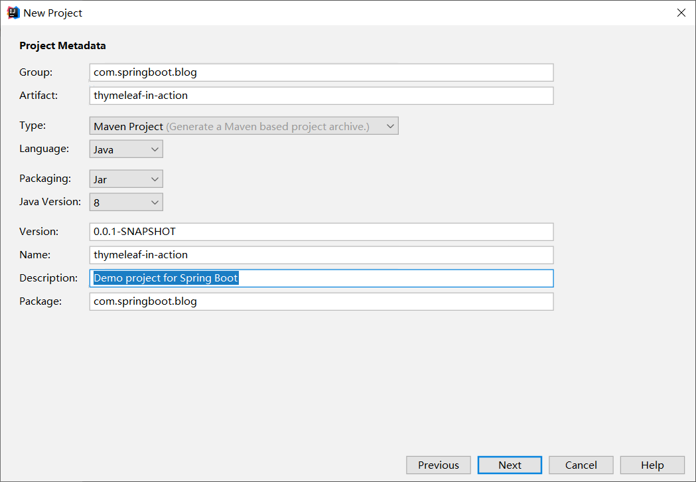

将之前 `hello-world` 项目中的 controller 拷贝过来，引入 thymeleaf 依赖：

```xml
<!-- https://mvnrepository.com/artifact/org.springframework.boot/spring-boot-starter-thymeleaf -->
<dependency>
    <groupId>org.springframework.boot</groupId>
    <artifactId>spring-boot-starter-thymeleaf</artifactId>
    <version>2.2.1.RELEASE</version>
</dependency>
```

完整 pom 文件如下：

```xml
<?xml version="1.0" encoding="UTF-8"?>
<project xmlns="http://maven.apache.org/POM/4.0.0" xmlns:xsi="http://www.w3.org/2001/XMLSchema-instance"
         xsi:schemaLocation="http://maven.apache.org/POM/4.0.0 https://maven.apache.org/xsd/maven-4.0.0.xsd">
    <modelVersion>4.0.0</modelVersion>
    <parent>
        <groupId>org.springframework.boot</groupId>
        <artifactId>spring-boot-starter-parent</artifactId>
        <version>2.2.1.RELEASE</version>
        <relativePath/> <!-- lookup parent from repository -->
    </parent>
    <groupId>com.springboot.blog</groupId>
    <artifactId>thymeleaf-in-action</artifactId>
    <version>0.0.1-SNAPSHOT</version>
    <name>thymeleaf-in-action</name>
    <description>Demo project for Spring Boot</description>

    <properties>
        <java.version>1.8</java.version>
    </properties>

    <dependencies>
        <dependency>
            <groupId>org.springframework.boot</groupId>
            <artifactId>spring-boot-starter-web</artifactId>
        </dependency>

        <dependency>
            <groupId>org.projectlombok</groupId>
            <artifactId>lombok</artifactId>
            <optional>true</optional>
        </dependency>
        <dependency>
            <groupId>org.springframework.boot</groupId>
            <artifactId>spring-boot-starter-test</artifactId>
            <scope>test</scope>
            <exclusions>
                <exclusion>
                    <groupId>org.junit.vintage</groupId>
                    <artifactId>junit-vintage-engine</artifactId>
                </exclusion>
            </exclusions>
        </dependency>

        <!-- https://mvnrepository.com/artifact/org.springframework.boot/spring-boot-starter-thymeleaf -->
        <dependency>
            <groupId>org.springframework.boot</groupId>
            <artifactId>spring-boot-starter-thymeleaf</artifactId>
            <version>2.2.1.RELEASE</version>
        </dependency>

    </dependencies>

    <build>
        <plugins>
            <plugin>
                <groupId>org.springframework.boot</groupId>
                <artifactId>spring-boot-maven-plugin</artifactId>
            </plugin>
        </plugins>
    </build>

</project>
```

至此，我们的 thymeleaf  集成就完成了，启动项目在浏览器中访问 http://localhost:8080/hello 可以看到返回 `Hello World!` 。

## 5.3、Thymeleaf 实战

上一节我们在 Spring Boot 中成功集成了 Thymeleaf ，这一节我们继续在 `thymeleaf-in-action` 项目中来学习和完善。

首先我们修改 `application.properties` 文件：

```properties
# THYMELEAF
spring.thymeleaf.encoding=UTF-8
# 热部署静态文件
spring.thymeleaf.cache=false
# 使用HTML5标准，这个如果提示 warring 可以改用 HTML 标准
spring.thymeleaf.mode=HTML5
```

### 5.31、设计API

- GET `/users` : 返回用于展现用户列表的 `list.heml` 页面
- GET `/users/{id}` ：返回用于展现用户信息的 `view.html` 页面
- GET `/users/form` ：返回用于新增或修改用户的 `form.html` 页面
- POST `/users `：新增或修改用户，成功后重定向到 `list.html` 页面
- GET `/users/delete/{id}` ：根据 id 删除用户数据，成功后重定向到 `list.html` 页面
- GET `/users/modify/{id}` ：根据 id 获取用户数据，并返回 `form.html` 页面用来执行修改

> 此处只做演示，未使用遵循 rest 风格的接口

### 5.3.2、后台编码

- 实体 User
- 资源库 UserRepository ：用户存储操作
- 控制器 UserController ：处理用户请求

1、在`src\main\java\com\springboot\blog\domain\`包下新建 `User.java` 类

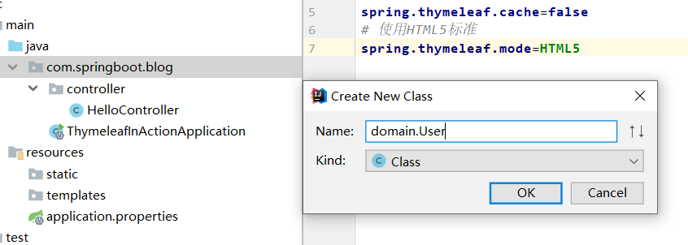

User 代码如下：

```java
@Data
@NoArgsConstructor
@AllArgsConstructor
public class User {
    /** 用户的唯一标识 */
    private Long id;
    private String name;
    private Integer age;
}
```

2、在 `src\main\java\com\springboot\blog\repository\` 包下新建 `UserRepository.java`接口：

```java
public interface UserRepository {

    /**
     * 新增或者修改用户
     *
     * @param user
     * @return
     */
    User saveOrUpdateUser(User user);

    /**
     * 删除用户
     *
     * @param id
     */
    void deleteUser(Long id);

    /**
     * 根据用户id获取用户
     *
     * @param id
     * @return
     */
    User getUserById(Long id);

    /**
     * 获取所有用户的列表
     *
     * @return
     */
    List<User> listUser();
}
```

在 `src\main\java\com\springboot\blog\repository\impl\` 包下新建 `UserRepositoryImpl.java` 类来实现 `UserRepository` 接口。

> 因为我们现在还没有使用数据库，所以我们可以先将用户的数据存储在一个 `MAP` 中，我们这里使用`ConcurrentHashMap` 来存储。
>
> 因为用户 Id 唯一，我们可以使用 `AtomicLong` 来每一次递增一个数生成用户 id。

```java
@Repository // 别忘了注入bean
public class UserRepositoryImpl implements UserRepository {

    /**
     * 因为用户 Id 唯一，我们可以使用 AtomicLong 来每一次递增一个数生成用户 id。
     */
    private static AtomicLong counter = new AtomicLong();
    /**
     * 因为我们现在还没有使用数据库，所以我们可以先将用户的数据存储在一个 MAP中，我们这里使用ConcurrentHashMap来存储。
     */
    private final ConcurrentMap<Long, User> userMap = new ConcurrentHashMap<>();

    @Override
    public User saveOrUpdateUser(User user) {
        Long id = user.getId();
        // 新建
        if (id == null) {
            // id自增
            id = counter.incrementAndGet();
            user.setId(id);
        }
        this.userMap.put(id, user);
        return user;
    }

    @Override
    public void deleteUser(Long id) {
        this.userMap.remove(id);
    }

    @Override
    public User getUserById(Long id) {
        return this.userMap.get(id);
    }

    @Override
    public List<User> listUser() {
        return (ArrayList<User>) this.userMap.values();
    }
}
```

3、在 `src\main\java\com\springboot\blog\controller\` 包下新建 `UserController.java` 类，并实现之前设计的API接口。

```java
@RestController
@RequestMapping("/users")
public class UserController {

    @Autowired
    private UserRepository userRepository;

    /**
     * 从 用户存储库 获取用户列表
     *
     * @return
     */
    private List<User> getUserList() {
        return userRepository.listUser();
    }

    /**
     * 查询所用用户
     *
     * @param model
     * @return
     */
    @GetMapping
    public ModelAndView list(Model model) {
        model.addAttribute("userList", this.getUserList());
        model.addAttribute("title", "用户管理");
        return new ModelAndView("users/list", "userModel", model);
    }

    /**
     * 根据id查询用户
     *
     * @param id
     * @param model
     * @return
     */
    @GetMapping("{id}")
    public ModelAndView view(@PathVariable("id") Long id, Model model) {
        User user = userRepository.getUserById(id);
        model.addAttribute("user", user);
        model.addAttribute("title", "查看用户");
        return new ModelAndView("users/view", "userModel", model);
    }

    /**
     * 获取 form 表单页面
     *
     * @param model
     * @return
     */
    @GetMapping("/form")
    public ModelAndView createForm(Model model) {
        model.addAttribute("user", new User());
        model.addAttribute("title", "创建用户");
        return new ModelAndView("users/form", "userModel", model);
    }

    /**
     * 新建用户
     *
     * @param user
     * @return
     */
    @PostMapping
    public ModelAndView create(User user) {
        user = userRepository.saveOrUpdateUser(user);
        return new ModelAndView("redirect:/users");
    }

    /**
     * 删除用户
     *
     * @param id
     * @param model
     * @return
     */
    @GetMapping(value = "delete/{id}")
    public ModelAndView delete(@PathVariable("id") Long id, Model model) {
        userRepository.deleteUser(id);
        model.addAttribute("userList", this.getUserList());
        model.addAttribute("title", "删除用户");
        return new ModelAndView("users/list", "userModel", model);
    }

    /**
     * 修改用户
     *
     * @param id
     * @param model
     * @return
     */
    @GetMapping(value = "modify/{id}")
    public ModelAndView modifyForm(@PathVariable("id") Long id, Model model) {
        User user = userRepository.getUserById(id);
        model.addAttribute("user", user);
        model.addAttribute("title", "修改用户");
        return new ModelAndView("users/form", "userModel", model);
    }

}
```

### 5.3.3、前端编码

- list.html  展示用户列表
- form.html 新增或修改用户资料
- view.html 查看用户资料

- header.html 公用的头部页面
- footer.html 公用的底部页面

header 和 footer 我们使用 thymeleaf 中的 `th:fragment` 特性来完成

1、在 `src\main\resources\templates` 目录下中新建 `fragments` 目录，用来存在模板文件。

`footer.html`：

`footer.html`：

```xml
<!DOCTYPE html>
<html lang="en">
<head>
    <meta charset="UTF-8">
    <title>Thymeleaf in action</title>
</head>
<body>
<div data-th-fragment="footer">
    <a href="https://blog.csdn.net/runewbie">Welcome to blog.csdn.net</a>
</div>
</body>
</html>
```

`header.html`：

```xml
<!DOCTYPE html>
<html lang="en">
<head>
    <meta charset="UTF-8">
    <title>Thymeleaf in action</title>
</head>
<body>
<div data-th-fragment="header">
    <h1>Thymeleaf in action</h1>
    <a href="/users">首页</a>
</div>
</body>
</html>
```

2、在 `src\main\resources\templates` 目录下中新建`users` 目录，存放业务相关的页面文件。

`list.html`：展示用户列表

```xml
<!DOCTYPE html>
<html xmlns:th="http://www.thymeleaf.org"
      xmlns:layout="http://www.ultraq.net.nz/thymeleaf/layout">
<head>
    <title th:text="${userModel.title}">welcome</title>
</head>
<body>
<div th:replace="~{fragments/header :: header}">...</div>
<h3 th:text="${userModel.title}">Welcome to blog.csdn.net</h3>
<div>
    <a href="/users/form.html">创建用户</a>
</div>
<table border="1">
    <thead>
    <tr>
        <td>ID</td>
        <td>Age</td>
        <td>Name</td>
    </tr>
    </thead>
    <tbody>
    <tr th:if="${userModel.userList.size()} eq 0">
        <td colspan="3">没有用户信息！！</td>
    </tr>
    <tr th:each="user : ${userModel.userList}">
        <td th:text="${user.id}">1</td>
        <td th:text="${user.age}">11</td>
        <td><a href="view.html" th:href="@{'/users/' + ${user.id}}"
               th:text="${user.name}">waylau</a></td>
    </tr>
    </tbody>
</table>
<div th:replace="~{fragments/footer :: footer}">...</div>
</body>
</html>
```

`form.html`：提交用户表单

```xml
<!DOCTYPE html>
<html xmlns:th="http://www.thymeleaf.org"
      xmlns:layout="http://www.ultraq.net.nz/thymeleaf/layout">
<head>
    <title th:text="${userModel.title}">users : View</title>
</head>
<body>
<div th:replace="~{fragments/header :: header}">...</div>
<h3 th:text="${userModel.title}">Welcome to blog.csdn.net</h3>
<div>
    <a href="/users">返回主页</a>
</div>
<form action="/users" method="POST" th:object="${userModel.user}">
    <input type="hidden" name="id" th:value="*{id}">
    名称:<br>
    <input type="text" name="name" th:value="*{name}">
    <br>
    年龄:<br>
    <input type="text" name="age" th:value="*{age}">
    <input type="submit" value="提交">
</form>
<div th:replace="~{fragments/footer :: footer}">...</div>
</body>
</html>
```

`view.html`：查看用户信息

```xml
<html xmlns:th="http://www.thymeleaf.org"
      xmlns:layout="http://www.ultraq.net.nz/thymeleaf/layout">
<head>
    <title th:text="${userModel.title}">users : View</title>
</head>
<body>
<div th:replace="~{fragments/header :: header}">...</div>
<h3 th:text="${userModel.title}">Welcome to blog.csdn.net</h3>
<div>
    <a href="/users">返回主页</a>
</div>
<div>
    <p><strong>ID:</strong><span id="id" th:text="${userModel.user.id}">123</span></p>
    <p><strong>Name:</strong><span id="name" th:text="${userModel.user.name}">waylau</span></p>
    <p><strong>Age:</strong><span id="age" th:text="${userModel.user.age}">30</span></p>
</div>

<div>
    <a th:href="@{'/users/delete/' + ${userModel.user.id}}">删除 </a>
    | <a th:href="@{'/users/modify/' + ${userModel.user.id}}">修改</a>
</div>
<div th:replace="~{fragments/footer :: footer}">...</div>
</body>
</html>
```

3、启动测试项目

在完成之前`1`和`2`的操作之后，我们可以启动项目来测试一下，启动后如果系统正常，可以看到下面的界面：

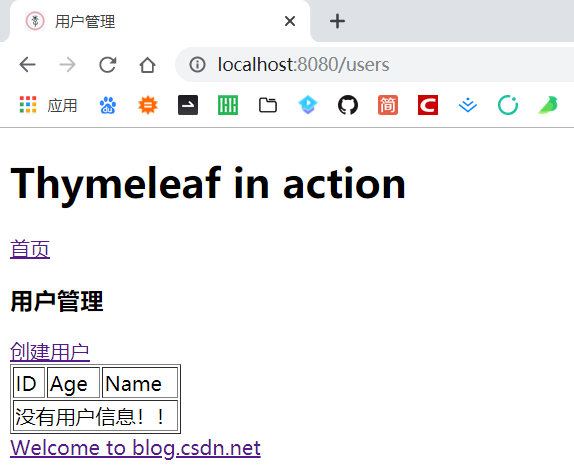


我们点击创建用户新建几条数据：

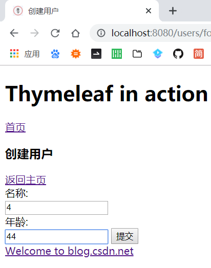

插入数据之后的效果，可以看到 ID 是自增的：

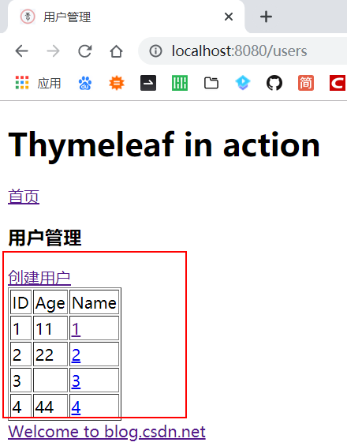

点击某一条 name 可以数据的修改和删除操作：

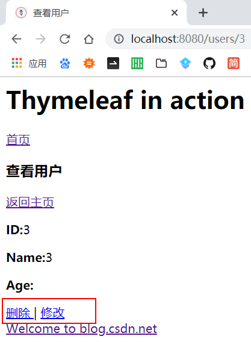

至此，我们关于 Thymeleaf 的入门实战就介绍完毕了。可能有人注意到了，我的页签带有一个自定义的图标：

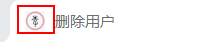

这个图标是怎么添加的呢？其实很简单，就是在 `src\main\resources\static` 目录下添加一个自己喜欢的 `favicon.ico` 文件即可。`ico` 格式文件可以照一张图片修改名称即可获取。然后重新启动服务就可以看到图标，如果看不到，是因为浏览器存在缓存，可以关闭浏览器重新打开对应页面即可。

以上就是我们的 Thymeleaf  学习，更对内容可以查看源代码获取。

## 源代码

[thymeleaf-in-action](https://github.com/Runewbie/Spring-Boot-Blog-In-Action/tree/master/thymeleaf-in-action)

# 第6章 数据持久化 Spring Data JPA

## 6.1、本节目标：

- JPA 简介
- Spring Data JPA 用法介绍
- Spring Data JPA、Hibernate/Mybatis/Mybatis-plus 与 Spring Boot 集成
- 数据持久化实战

## 6.2、JPA 简介

### 6.2.1、什么是JPA？

-  JPA是Java Persistence API的简称，中文名Java持久层API，是JDK 5.0注解或XML描述`对象－关系表`的映射关系，并将运行期的实体对象持久化到数据库中。 

- 最新规范为 [**JSR 338: Java**TM **Persistence 2.2**](https://jcp.org/en/jsr/detail?id=338) 
- 实现： 支持 JPA 2.2 版本的框架
  - [DataNucleus](https://en.wikipedia.org/wiki/DataNucleus) (from version 5.1)
  - [EclipseLink](https://en.wikipedia.org/wiki/EclipseLink) (from version 2.7)
  - [Hibernate](https://en.wikipedia.org/wiki/Hibernate_(Java)) (from version 5.3)
  - [OpenJPA](https://en.wikipedia.org/wiki/OpenJPA) (from version 3.0)

### 6.2.2、JPA 核心概念

- 实体
  - 实体表示关系数据库中的表
  - 每个实体实例对应于该表中的行
  - 类必须用 *javax*.persistence.*Entity* 注解
  - 类必须有一个 `public` 或 `protected` 的无参构造函数
  - 实体实例被当做值以分离对象方式进行传递（例如通过会话bean的远程业务接口），则该类必须实现 `Serializable` 接口
  - 唯一的对象识别符：简单主键（`javax.persistence.idjavax.persistence.Id`）、复合主键（`javax.persistence.EmbeddedId` 和 `javax.persistence.IdClass`）

- 关系
  - 一对一：@OneToOne
  - 一对多：@OneToMany
  - 多对一：@ManyToOne
  - 多对多：@ManyToMany

### 6.2.3、EntityManager

EntityManager接口：

- 定义用于与持久性上下文进项交互的方法
- 创建和删除持久实体实例，通过实体的主键查找实体
- 允许在实体上运行查询

获取 EntityManager 实例：

```java
EntityManagerFactory emf=Persistence.createEntityManagerFactory("Student_details");  
```

查找实体：

```java
EntityManagerFactory emf=Persistence.createEntityManagerFactory("Student_details");  
EntityManager em=emf.createEntityManager();  
StudentEntity s=em.find(StudentEntity.class,101); 
```

## 6.3、Spring Data JPA

### 6.3.1、什么是 Spring Data JPA？

- 是较大的 Spring Data 家族的一部分
- 对基于 JPA 的数据访问层的增强支持
- 使得构建使用数据访问技术的 spring 驱动的应用程序更加容易
- [官方文档](https://spring.io/projects/spring-data-jpa)

### 6.3.2、常用接口

`CrudRepository：`

```java
@NoRepositoryBean
public interface CrudRepository<T, ID> extends Repository<T, ID> {
    <S extends T> S save(S var1);

    <S extends T> Iterable<S> saveAll(Iterable<S> var1);

    Optional<T> findById(ID var1);

    boolean existsById(ID var1);

    Iterable<T> findAll();

    Iterable<T> findAllById(Iterable<ID> var1);

    long count();

    void deleteById(ID var1);

    void delete(T var1);

    void deleteAll(Iterable<? extends T> var1);

    void deleteAll();
}
```

`PagingAndSortingRepository`用来分页：

```java
public interface PagingAndSortingRepository<T, ID> extends CrudRepository<T, ID> {
    Iterable<T> findAll(Sort var1);

    Page<T> findAll(Pageable var1);
}
```

`自定义查询：`根据方法名创建查询，继承Repository

## 6.4、Spring Data JPA、Hibernate 与 Spring Boot 集成

环境准备

- Mysql 8
- Spring Data JPA
- Hibernate
- Mysql Connector/J

新建一个 `jpa-in-action` 的项目，将上一节中`thymeleaf-in-action` 中的内容拷贝过来。

修改pom文件，添加相关依赖：

```xml
<!-- spring-boot-starter-data-jpa依赖，可以省略版本，Spring Boot中已已自动帮我们定义依赖版本 -->
<dependency>
    <groupId>org.springframework.boot</groupId>
    <artifactId>spring-boot-starter-data-jpa</artifactId>
</dependency>
<!-- mysql依赖 -->
<dependency>
    <groupId>mysql</groupId>
    <artifactId>mysql-connector-java</artifactId>
    <version>8.0.16</version>
</dependency>
<!-- 内存数据库，只在运行时使用，因为目前还没有使用mysql数据库，引入了mysql的依赖之后启动会报错，所以先引入h2内存数据库-->
<dependency>
    <groupId>com.h2database</groupId>
    <artifactId>h2</artifactId>
    <version>1.4.199</version>
    <scope>runtime</scope>
</dependency>
```

`注意：`上面引入了H2内存数据库，在运行时使用，如果不引入，因为我们目前还没有指定数据源，但是又引入了mysql的依赖，直接启动项目回报如下错误：

> Action:
>
> Consider the following:
> 	If you want an embedded database (H2, HSQL or Derby), please put it on the classpath.
> 	If you have database settings to be loaded from a particular profile you may need to activate it (no profiles are currently active).

修改我们的实体类`User`：

```java
@Data
@NoArgsConstructor
@AllArgsConstructor
@Entity
public class User implements Serializable {
    /** 用户的唯一标识 */
    @Id
    private Long id;
    private String name;
    private Integer age;
}
```

`注意`：我们要在实体类上添加`@Entity`和`@Id`注解，同时要实现`Serializable`，不然我们之后在浏览器端进行用户创建操作的时候无法在h2中自动创建表。

删除原有的 `impl` 包及其包中的内容，修改 `UserRepository`,使其继承JPA的`CrudRepository`接口：

```java
public interface UserRepository extends CrudRepository<User, Long> {

}
```

同时我们还要修改`UserController`，使其使用`CrudRepository`提供的默认方法：

```java

@RestController
@RequestMapping("/users")
public class UserController {

    @Autowired
    private UserRepository userRepository;

    /**
     * 从 用户存储库 获取用户列表
     *
     * @return
     */
    private List<User> getUserList() {
        List<User> list = new ArrayList<>();
        Iterable<User> users = userRepository.findAll();
        users.forEach(user -> {
            list.add(user);
        });
        return list;
    }

    /**
     * 查询所用用户
     *
     * @param model
     * @return
     */
    @GetMapping
    public ModelAndView list(Model model) {
        model.addAttribute("userList", this.getUserList());
        model.addAttribute("title", "用户管理");
        return new ModelAndView("users/list", "userModel", model);
    }

    /**
     * 根据id查询用户
     *
     * @param id
     * @param model
     * @return
     */
    @GetMapping("{id}")
    public ModelAndView view(@PathVariable("id") Long id, Model model) {
        Optional<User> user = userRepository.findById(id);
        model.addAttribute("user", user);
        model.addAttribute("title", "查看用户");
        return new ModelAndView("users/view", "userModel", model);
    }

    /**
     * 获取 form 表单页面
     *
     * @param model
     * @return
     */
    @GetMapping("/form")
    public ModelAndView createForm(Model model) {
        model.addAttribute("user", new User());
        model.addAttribute("title", "创建用户");
        return new ModelAndView("users/form", "userModel", model);
    }

    /**
     * 新建用户
     *
     * @param user
     * @return
     */
    @PostMapping
    public ModelAndView create(User user) {
        user = userRepository.save(user);
        return new ModelAndView("redirect:/users");
    }

    /**
     * 删除用户
     *
     * @param id
     * @param model
     * @return
     */
    @GetMapping(value = "delete/{id}")
    public ModelAndView delete(@PathVariable("id") Long id, Model model) {
        userRepository.deleteById(id);
        model.addAttribute("userList", this.getUserList());
        model.addAttribute("title", "删除用户");
        return new ModelAndView("users/list", "userModel", model);
    }

    /**
     * 修改用户
     *
     * @param id
     * @param model
     * @return
     */
    @GetMapping(value = "modify/{id}")
    public ModelAndView modifyForm(@PathVariable("id") Long id, Model model) {
        Optional<User> user = userRepository.findById(id);
        model.addAttribute("user", user);
        model.addAttribute("title", "修改用户");
        return new ModelAndView("users/form", "userModel", model);
    }

}
```

同时我们在`application.properties`文件中添加h2的web访问配置，这样我们就可以在浏览器端访问内存数据库：

```properties
# 使用 h2 的控制台，便于我们在web端访问内存数据库，
spring.h2.console.enabled=true
```

启动我们的应用，访问 http://localhost:8080/users 创建几条数据，然后在浏览器访问 http://localhost:8080/h2-console ，可以看到h2的控制界面：

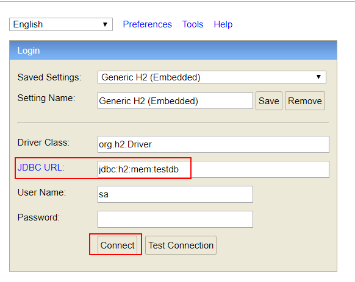

默认是没有密码的，我们直接点击 `Connect` 就可以连接上。 注意：`JDBC URL`默认是`jdbc:h2:~/test`，而Spring Boot的默认数据库url应该是`jdbc:h2:mem:testdb`，否则进去后找不到JPA创建的数据表，如果连接报错，一般是`JDBC URL`错误，我们可以在启动日志中找到我们的内存数据库的地址：

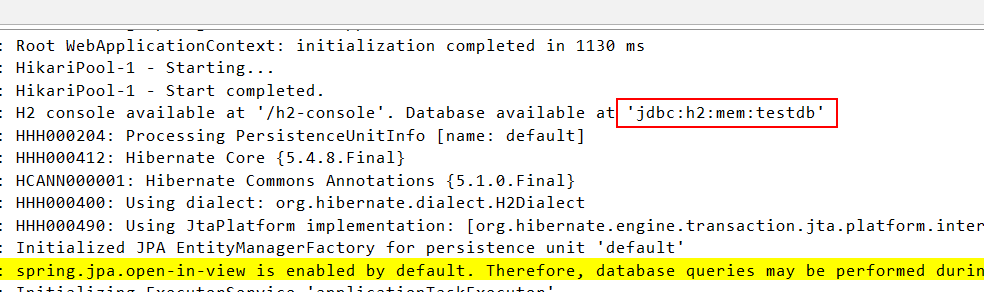

我们点击 `Connect` 后可以看到下面的界面：

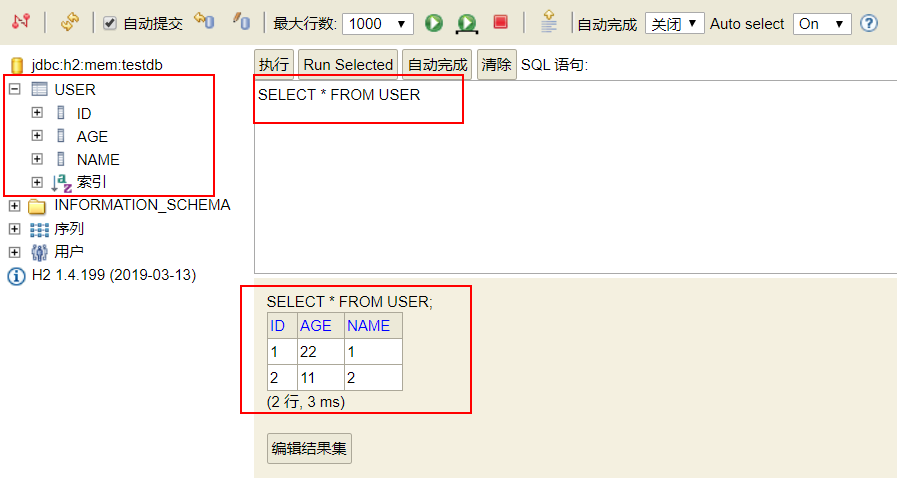

## 6.5、数据持久化实战

我们接着上一节的项目来学习，在6.4节我们将数据保存到了内存数据库`h2`中。但是在实际的生产环境中，我们是不可能将数据保存在内存中的，而是持久化到`Mysql`等数据库中。这一节我们就介绍如何将数据保存到mysql中。

修改`application.properties`，添加数据源：

```properties
# DataSource
spring.datasource.url=jdbc:mysql://localhost/blog?characterEncoding=utf-8&useSSL=false&serverTimezone=UTC
spring.datasource.username=root
spring.datasource.password=123456
spring.datasource.driver-class-name=com.mysql.cj.jdbc.Driver

# JPA 打印sql
spring.jpa.show-sql = true
# 在应用每次启动时删除数据库重新创建
spring.jpa.hibernate.ddl-auto=create-drop
```

安装启动 `Mysql Server`：

安装mysql可以选择在本地安装，也可以选择安装在linux虚拟机中，或者在虚拟机中安装docker，使用docker容器安装都可以，这里不过多叙述，读者请自行安装准备好。

在 `Mysql` 数据库中创建`blog`数据库：

```sql
CREATE DATABASE blog;
```

启动项目，我们可以看到在`idea`的控制台打印了如下信息：

```sql
Hibernate: drop table if exists user
Hibernate: create table user (id bigint not null auto_increment, age integer, name varchar(255), primary key (id)) engine=InnoDB
```

打开数据库管理器可以看到`JPA`自动帮我们在数据库中创建了数据表：

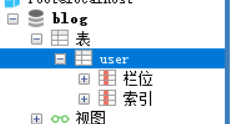

我们在浏览器端访问我们的项目界面，插入数据，可以看到用户信息被持久化到了`mysql`中。而我们访问 http://localhost:8080/h2-console 查看我们的内存数据库，发现内存数据库是无法进入的，因为这个时候我们指定了数据源为mysql数据库，因此内存数据库中就不会存在数据库表，我们在控制台也可以看到如下信息：

```shell
H2 console available at '/h2-console'. Database available at 'jdbc:mysql://localhost/blog?characterEncoding=utf-8&useSSL=false&serverTimezone=UTC
```

以上，就是我们有关Spring Data JPA 的简单介绍，更多内容我们在之后的使用中还会讲到。更对内容可以查看源代码获取。

## 源代码

[jpa-in-action](https://github.com/Runewbie/Spring-Boot-Blog-In-Action/tree/master/jpa-in-action) 

# 第7章 全文搜索 ElasticSearch

---

# 第8章 架构设计与分层

# 第9章 集成 Bootstrap

# 第10章 博客系统的需求分析与原型设计

# 第11章 权限管理 Spring Security

# 第12章 博客系统的整体框架实现

---

# 第13章 博客系统的用户管理实现

# 第14章 博客系统的角色管理实现

# 第15章 博客系统的权限管理实现

# 第16章 博客系统的博客管理实现

# 第17章 博客系统的评论管理实现

# 第18章 博客系统的点赞管理实现

# 第19章 博客系统的分类管理实现

# 第20章 博客系统的标签管理实现

# 第21章 博客系统的搜索实现

# 第22章 博客系统总结

